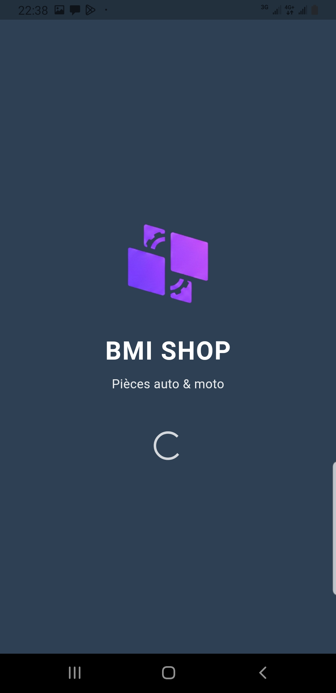
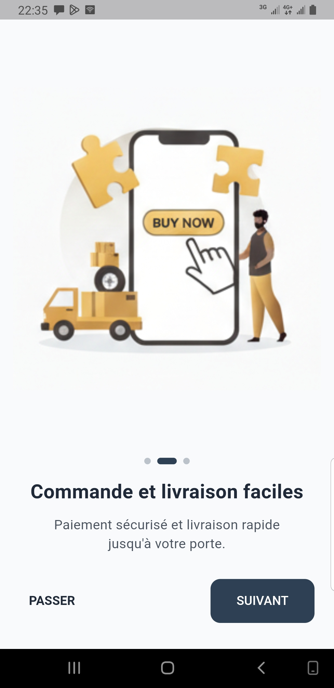
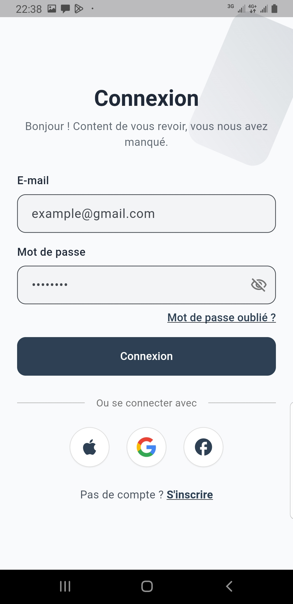
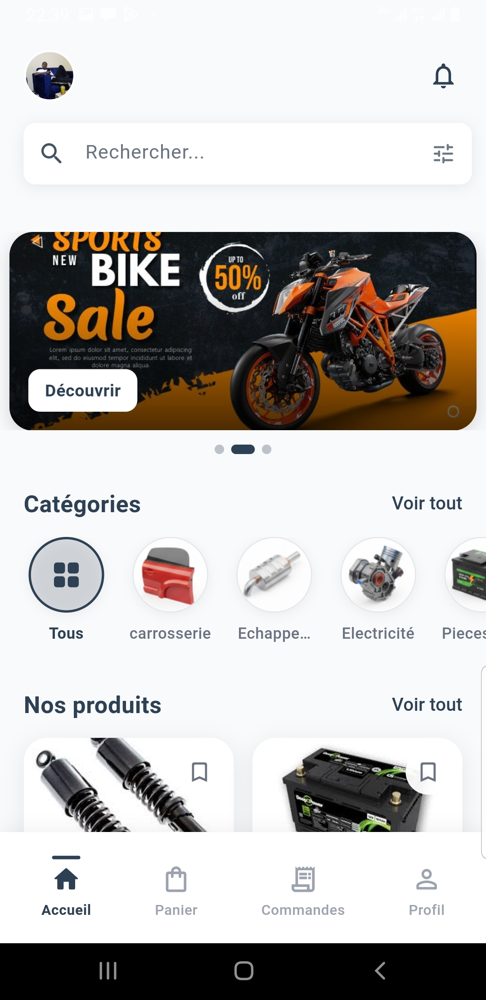
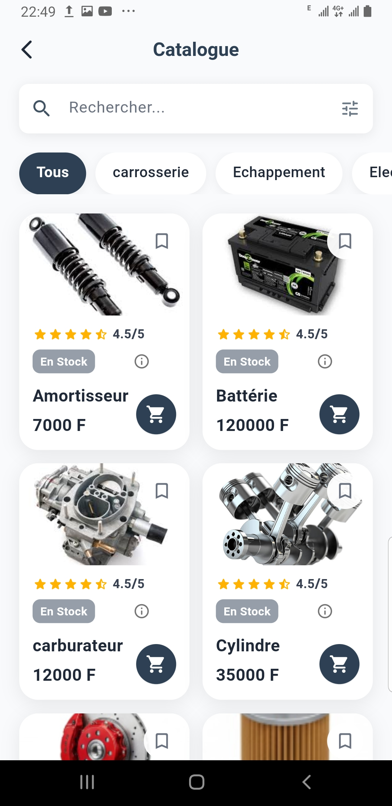
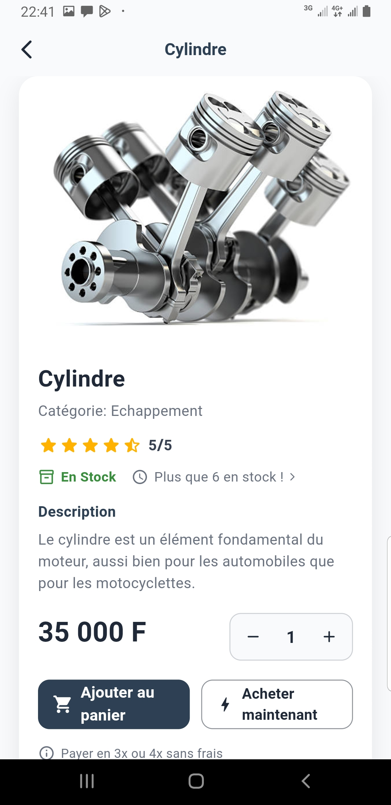
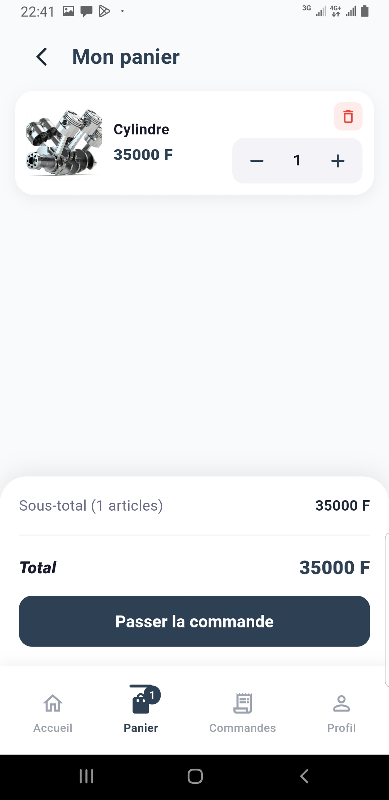
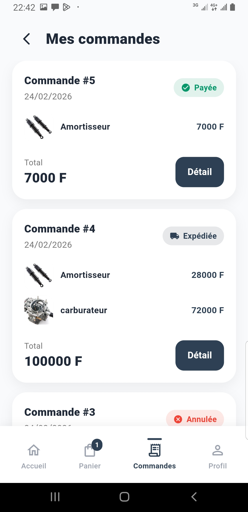
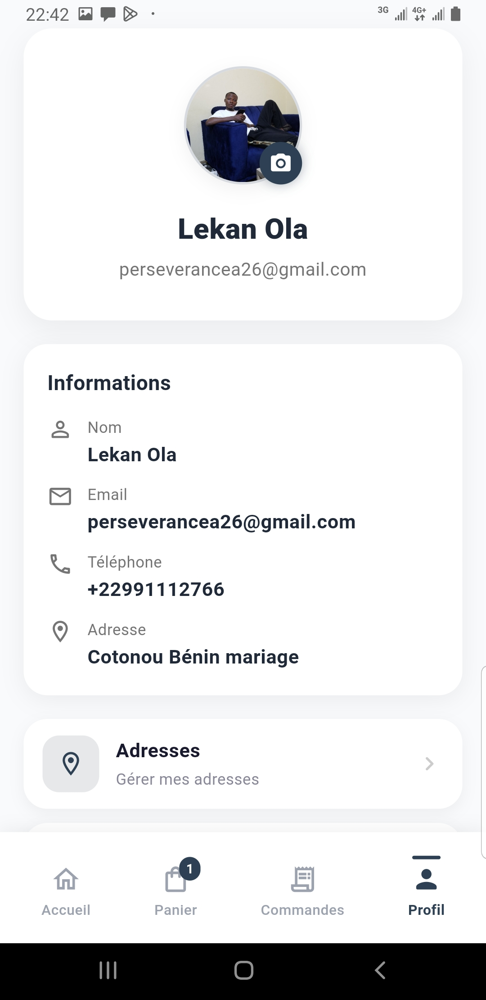

# BMI SHOP

<p align="center">
  
  
  
  
  
  
</p>

**Boutique mobile pièces auto & moto** — Catalogue, panier, commande et paiement Mobile Money (FedaPay) dans une seule app.

---

## Aperçu

BMI SHOP est une application mobile e-commerce qui permet de parcourir le catalogue, gérer le panier, passer commande et payer via **FedaPay** (Mobile Money) sans quitter l’app.

- **Backend** : API Laravel — [Documentation](https://ai4bmi.cabinet-xaviertermeau.com/api-docs)

---

## Captures d’écran

**Splash · Onboarding · Connexion · Accueil**

| | | | |
|:---:|:---:|:---:|:---:|
|  |  |  |  |

**Catalogue · Détail produit · Panier · Commandes · Profil**

| | | | | |
|:---:|:---:|:---:|:---:|:---:|
|  |  |  |  |  |

---

## Démarrage rapide

```bash
git clone https://github.com/iamrachking/BMI_MOBILE_APP.git
cd BMI_MOBILE_APP
flutter pub get
flutter run
```

- **Flutter** : SDK ^3.9.2  
- **Émulateur** : Android Studio, Xcode ou appareil physique

Régénérer l’icône de l’app :

```bash
dart run flutter_launcher_icons
```

---

## Stack

- **Flutter** + **GetX** (état & navigation)
- **Dio** (API, Bearer token)
- **webview_flutter** (paiement FedaPay)
- **get_storage** (token, onboarding)

---

## Configuration API

- **Production** : `https://ai4bmi.cabinet-xaviertermeau.com/api`
- **Local** : éditer `lib/config/api_config.dart` (ex. `http://10.0.2.2:8000/api` pour Android).

---

## Licence

MIT
